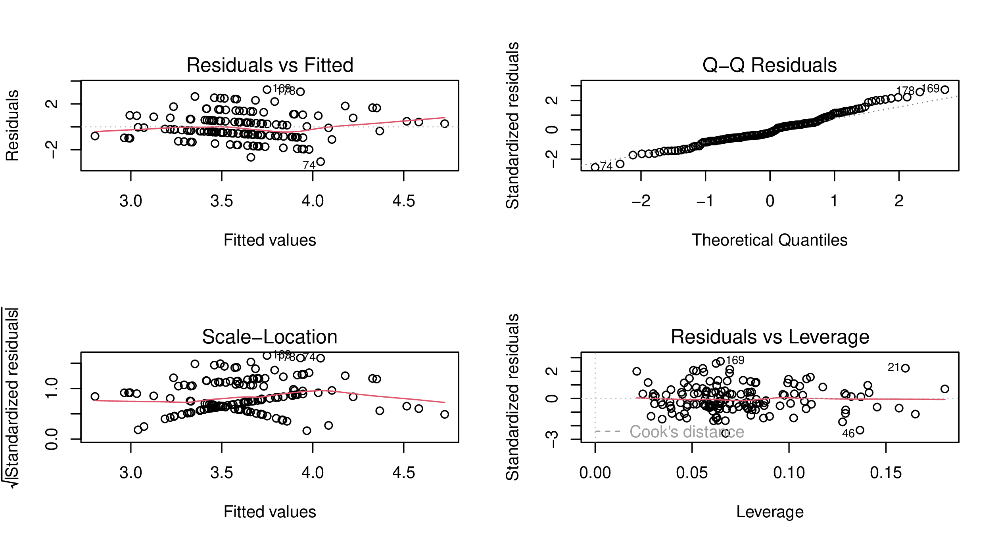
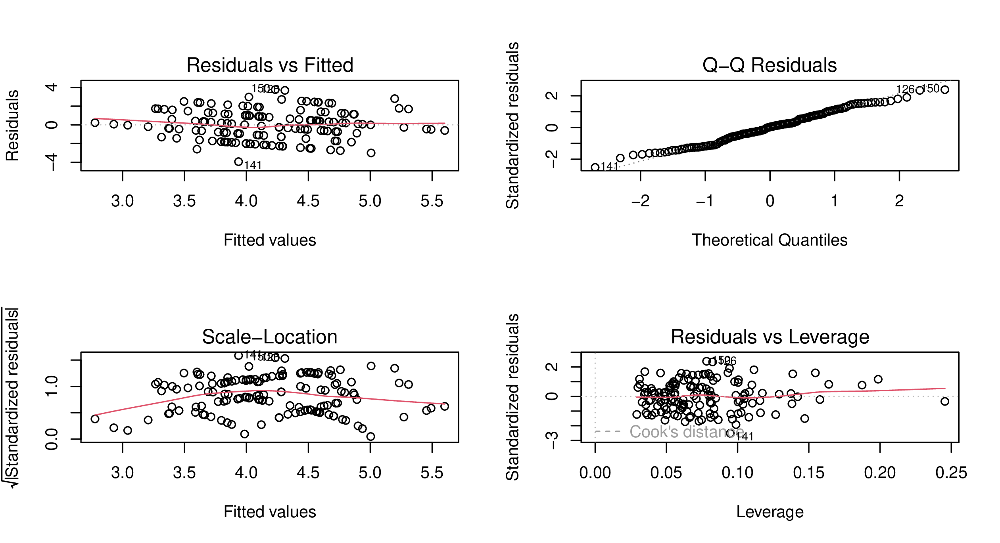
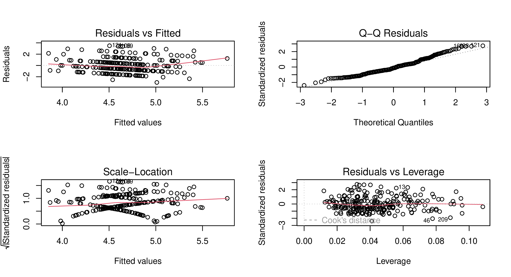
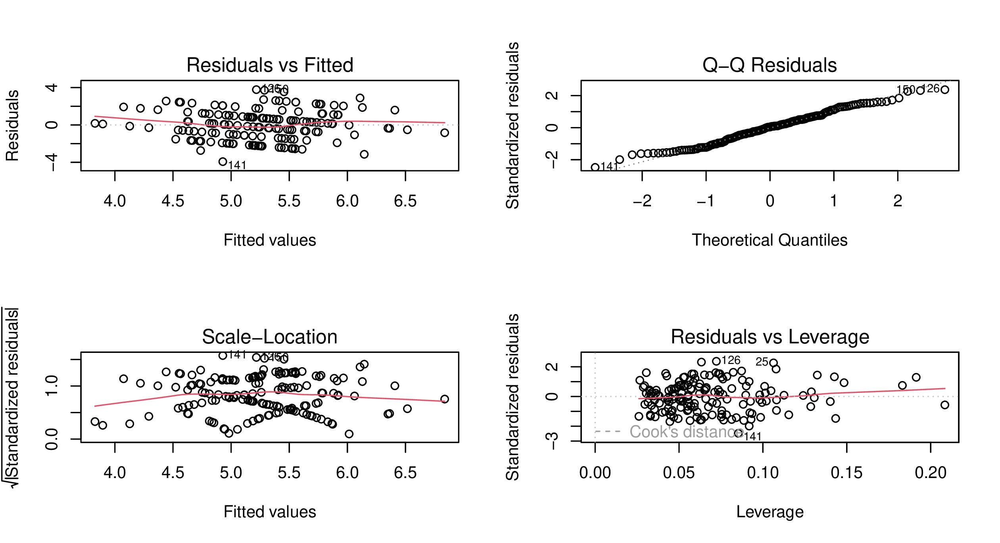
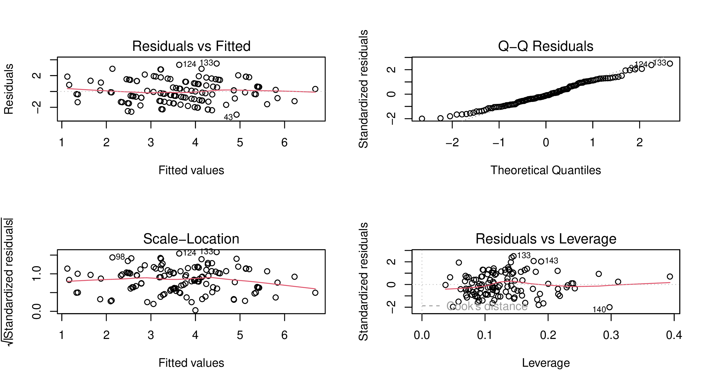
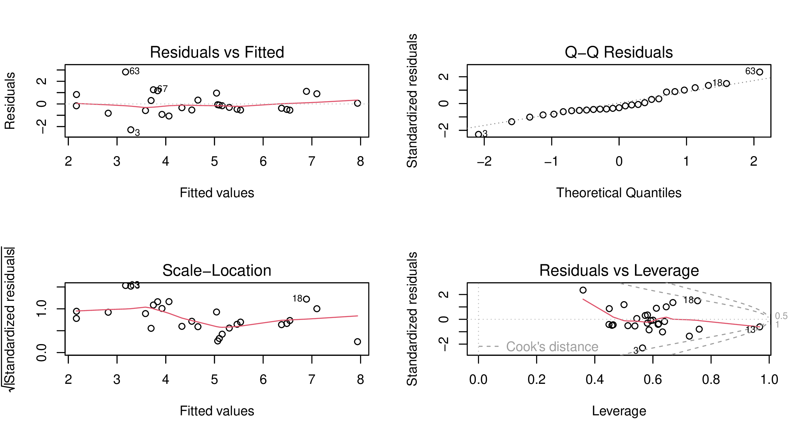
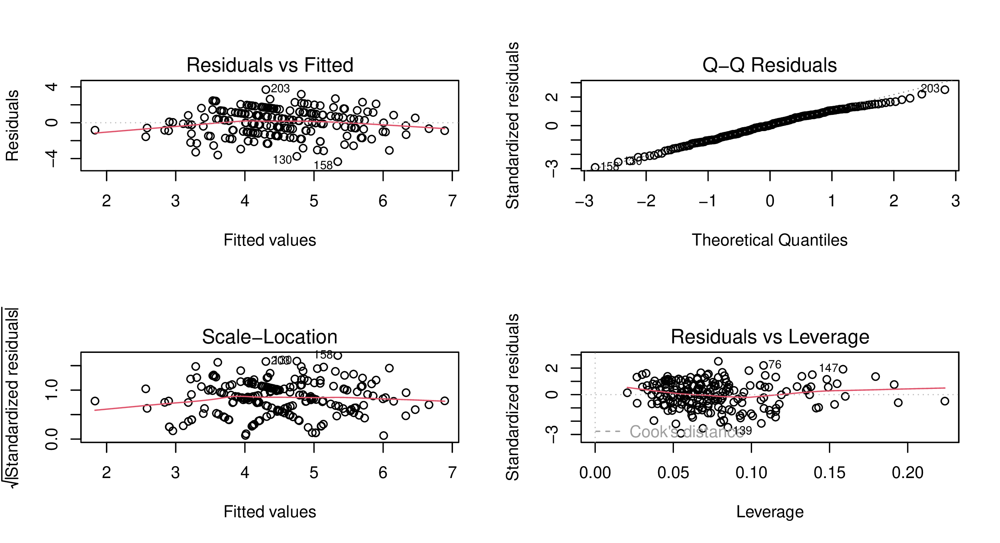
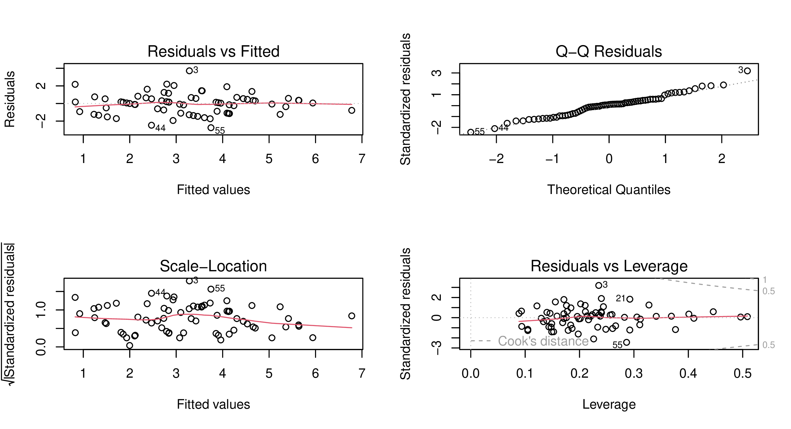

## Imputation Procedures

The following plots show a comparison between the original distribution of variables used in this analysis and the outcome of different imputation methods. The procedures are explained in the *Imputation* subchapter of the quantitative methodology chapter.  

The method used was the **CART imputation**, as the following plots showed this type of imputation was the closest to the original distributions.  

---

### Comparison between Original Variables and PMM, CART, and Lasso Imputed Distributions

  
  
  
  
  
  
  
  
  
  
  
  
  
  
  
  
  
  
  
  
  
  
  
  
  
  

## Comparison Model Diagnostic with Original and Imputed Data

The following plots show a comparison of model diagnostics on both the overall models and the models for the KRI and NES subsets. The diagnostics were made for both the imputed and non-imputed original datasets. These diagnostics are crucial for assessing the performance and reliability of the country fixed effects models as well as the model fit.  

Each diagnostic consists of four plots and respective measures:  

- **Residuals vs. Fitted Values Plot** – checks linearity between fitted and actual values.  
- **Normal Q-Q Plot** – tests normality of residuals.  
- **Scale-Location Plot** – checks homoscedasticity of residuals across predictor levels.  
- **Residuals vs. Leverage Plot** – identifies influential observations, measured by Cook’s Distance.  

Across all models, residuals appear randomly distributed, Q-Q plots follow a diagonal line, and Scale-Location plots show homoscedasticity. Original data reveals more heteroscedasticity than imputed datasets, especially in leverage plots, where influential points are more unevenly distributed.

---

### Diagnostics for Models with Original Dataset

  
*Figure: Diagnostic for Model 1 with Original Dataset*

  
*Figure: Diagnostic for Model 2 with Original Dataset*

  
*Figure: Diagnostic for Model 3 with Original Dataset*

  
*Figure: Diagnostic for Model 4 with Original Dataset*

---

### Diagnostics for Models with Imputed Dataset

  
*Figure: Diagnostic for Model 5 with Imputed Dataset*

  
*Figure: Diagnostic for Model 6 with Imputed Dataset*

  
*Figure: Diagnostic for Model 7 with Imputed Dataset*

  
*Figure: Diagnostic for Model 8 with Imputed Dataset*

---

### Country Subset Diagnostics

  
*Figure: Diagnostic for Turkey Model with Original Dataset*

  
*Figure: Diagnostic for Iran Model with Original Dataset*

  
*Figure: Diagnostic for Turkey Model with Imputed Dataset*

  
*Figure: Diagnostic for Iran Model with Imputed Dataset*

  
*Figure: Diagnostic for KRI Model with Original Dataset*

  
*Figure: Diagnostic for NES Model with Original Dataset*

  
*Figure: Diagnostic for KRI Model with Imputed Dataset*

  
*Figure: Diagnostic for NES Model with Imputed Dataset*

## Comparison Models with Original and Imputed Data

**Table 1 — Comparison between Original and Imputed Dataset in Fixed Effects Regression (Models 1–8)**

| Variable      | Model 1 (OG)     | Model 2 (OG)     | Model 3 (OG)      | Model 4 (OG)      | Model 5 (IMP)    | Model 6 (IMP)    | Model 7 (IMP)     | Model 8 (IMP)     |
|---------------|------------------|------------------|-------------------|-------------------|------------------|------------------|-------------------|-------------------|
| (Intercept)   | 3.84*** (0.26)   | 4.26*** (0.28)   | 4.94*** (0.41)    | 2.79*** (0.69)    | 4.63*** (0.22)   | 5.17*** (0.25)   | 5.66*** (0.35)    | 3.75*** (0.56)    |
| pol_interest  | 0.23*** (0.07)   | 0.25*** (0.07)   | 0.22** (0.07)     | 0.17* (0.08)      | 0.24*** (0.06)   | 0.23*** (0.06)   | 0.21*** (0.06)    | 0.17** (0.06)     |
| conf_gov      | -0.23*** (0.06)  | -0.23*** (0.07)  | -0.08 (0.10)      | -0.03 (0.10)      | -0.16** (0.06)   | -0.17** (0.06)   | 0.00 (0.09)       | 0.02 (0.09)       |
| country: Iraq | —                | -0.85*** (0.18)  | -1.04*** (0.24)   | -0.91*** (0.25)   | —                | -0.91*** (0.17)  | -1.13*** (0.21)   | -0.97*** (0.21)   |
| country: Syria| —                | -0.17 (0.27)     | -0.34 (0.34)      | -0.17 (0.38)      | —                | -0.06 (0.25)     | -0.32 (0.28)      | -0.09 (0.29)      |
| country: Turkey| —               | -0.65*** (0.17)  | -0.72*** (0.19)   | -0.40 (0.21)      | —                | -0.59*** (0.16)  | -0.72*** (0.17)   | -0.40* (0.18)     |
| conf_armed    | —                | —                | -0.31** (0.11)    | -0.29** (0.11)    | —                | —                | -0.15 (0.09)      | -0.11 (0.09)      |
| conf_part     | —                | —                | -0.01 (0.09)      | -0.07 (0.10)      | —                | —                | 0.03 (0.08)       | 0.01 (0.08)       |
| conf_court    | —                | —                | -0.04 (0.11)      | -0.03 (0.11)      | —                | —                | -0.03 (0.10)      | -0.05 (0.09)      |
| conf_parl     | —                | —                | -0.18 (0.11)      | -0.13 (0.11)      | —                | —                | -0.24** (0.09)    | -0.21* (0.09)     |
| conf_police   | —                | —                | 0.21 (0.12)       | 0.24 (0.13)       | —                | —                | 0.10 (0.10)       | 0.13 (0.10)       |
| relig_pers    | —                | —                | —                 | 0.16 (0.15)       | —                | —                | —                 | 0.19 (0.13)       |
| gender        | —                | —                | —                 | 0.22 (0.15)       | —                | —                | —                 | 0.20 (0.12)       |
| age           | —                | —                | —                 | 0.01* (0.01)      | —                | —                | —                 | 0.01* (0.00)      |
| edu           | —                | —                | —                 | 0.22*** (0.06)    | —                | —                | —                 | 0.19*** (0.05)    |

*Notes: OG = Original; IMP = Imputed. ***p<0.001; **p<0.01; *p<0.05.*

## Turkey and Iran Subset

**Table 2 — Comparison between Original and Imputed Dataset in Fixed Effects Regression (Turkey & Iran)**

| Variable      | Turkey OG        | Iran OG          | Turkey IMP        | Iran IMP         |
|---------------|------------------|------------------|-------------------|------------------|
| (Intercept)   | 3.14*** (0.91)   | 2.69 (1.53)      | 4.51*** (0.67)    | 3.41* (1.44)     |
| pol_interest  | 0.03 (0.11)      | -0.04 (0.15)     | 0.04 (0.09)       | -0.07 (0.14)     |
| conf_gov      | -0.01 (0.19)     | -0.06 (0.16)     | 0.05 (0.16)       | 0.05 (0.15)      |
| conf_armed    | 0.02 (0.17)      | -0.19 (0.22)     | 0.07 (0.13)       | -0.22 (0.21)     |
| conf_part     | 0.25 (0.17)      | 0.20 (0.17)      | 0.16 (0.12)       | 0.24 (0.17)      |
| conf_parl     | -0.25 (0.17)     | -0.36 (0.20)     | -0.34* (0.14)     | -0.40* (0.20)    |
| conf_police   | -0.11 (0.21)     | 0.09 (0.25)      | -0.06 (0.16)      | 0.17 (0.24)      |
| conf_court    | -0.03 (0.18)     | 0.17 (0.21)      | -0.11 (0.14)      | 0.16 (0.20)      |
| gender        | 0.07 (0.22)      | 0.05 (0.30)      | 0.17 (0.17)       | 0.13 (0.28)      |
| age           | 0.01 (0.01)      | 0.02* (0.01)     | 0.01 (0.01)       | 0.02* (0.01)     |
| edu           | -0.01 (0.09)     | 0.30* (0.13)     | 0.05 (0.07)       | 0.27* (0.12)     |
| relig_pers    | 0.18 (0.24)      | 0.04 (0.37)      | 0.05 (0.21)       | 0.05 (0.35)      |
| **R²**        | 0.06             | 0.11             | 0.06              | 0.09             |
| **Adj. R²**   | -0.01            | 0.03             | 0.02              | 0.03             |
| **Num. obs.** | 149              | 144              | 251               | 161              |

*Notes: ***p<0.001; **p<0.01; *p<0.05.*

## Iraq (KRI) and Syria (AANES) Subset

**Table 3 — Comparison between Original and Imputed Dataset in Fixed Effects Regression for Iraq and Syria Autonomy-Specific Covariates**

| Variable         | KRI OG           | AANES OG         | KRI IMP          | AANES IMP        |
|------------------|------------------|------------------|------------------|------------------|
| (Intercept)      | 2.67* (1.26)     | -0.08 (8.26)     | 2.68* (1.04)     | 2.05 (2.94)      |
| pol_interest     | 0.56*** (0.16)   | 0.33 (0.86)      | 0.47*** (0.11)   | 0.37 (0.46)      |
| conf_gov         | 0.22 (0.27)      | -1.85 (1.07)     | 0.11 (0.20)      | -1.06 (0.66)     |
| conf_armed       | -0.70** (0.22)   | -0.52 (1.47)     | -0.20 (0.16)     | 0.61 (0.73)      |
| conf_part        | -0.29 (0.22)     | -1.73 (0.81)     | -0.23 (0.18)     | -0.52 (0.37)     |
| conf_parl        | -0.03 (0.23)     | -0.10 (1.25)     | -0.09 (0.16)     | -0.57 (0.49)     |
| conf_police      | 0.50* (0.24)     | 0.24 (1.00)      | 0.16 (0.18)      | 0.50 (0.62)      |
| conf_court       | -0.33 (0.28)     | -0.46 (0.70)     | -0.19 (0.21)     | -0.33 (0.45)     |
| conf_krg         | -0.31 (0.28)     | —                | -0.11 (0.21)     | —                |
| conf_armed_kri   | -0.21 (0.21)     | —                | -0.14 (0.16)     | —                |
| conf_part_krd    | 0.27 (0.26)      | —                | 0.16 (0.20)      | —                |
| conf_parl_kri    | -0.33 (0.26)     | —                | -0.21 (0.20)     | —                |
| conf_police_kri  | 0.26 (0.21)      | —                | 0.15 (0.17)      | —                |
| gender           | 0.93** (0.32)    | -0.06 (1.09)     | 0.51* (0.25)     | -0.43 (0.49)     |
| age              | -0.02 (0.01)     | 0.08 (0.06)      | 0.00 (0.01)      | 0.04 (0.02)      |
| edu              | 0.14 (0.11)      | 0.41 (0.54)      | 0.21* (0.09)     | 0.15 (0.19)      |
| relig_pers       | -0.09 (0.27)     | -0.74 (1.06)     | 0.03 (0.24)      | 0.47 (0.42)      |
| conf_nes         | —                | 0.60 (1.06)      | —                | 0.16 (0.55)      |
| conf_armed_nes   | —                | -0.38 (1.21)     | —                | -0.02 (0.48)     |
| conf_part_nes    | —                | 0.54 (0.95)      | —                | 0.22 (0.31)      |
| conf_parl_nes    | —                | 0.68 (0.65)      | —                | 0.31 (0.28)      |
| conf_police_nes  | —                | 1.02 (1.06)      | —                | 0.14 (0.38)      |
| **R²**           | 0.39             | 0.72             | 0.20             | 0.32             |
| **Adj. R²**      | 0.30             | 0.26             | 0.14             | 0.09             |
| **Num. obs.**    | 120              | 27               | 203              | 65               |

*Notes: KRI = Kurdistan Region of Iraq; AANES = Autonomous Administration of North and East Syria. ***p<0.001; **p<0.01; *p<0.05.*
